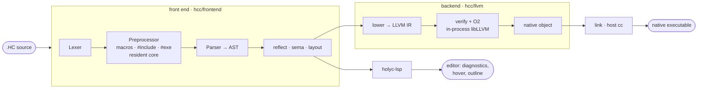

<div align="center">

# holyc

**A HolyC toolchain in Zig** — an optimizing compiler, a language server, and
editor support.


</div>

`hcc` compiles Terry Davis's HolyC to native executables through LLVM, and ships
a language server and editor integrations.

```console
$ sh install.sh
$ hcc -o sum sum.HC && ./sum
sum(1..100) = 5050
```

## Highlights

- **LLVM backend, pure-Zig front end.** The lexer, preprocessor, parser, sema,
  and layout are plain Zig; the checked AST lowers to LLVM IR through the
  in-process LLVM-C API and links with the host `cc`.
- **A faithful HolyC dialect.** Classes and unions with inheritance and
  reflection, `try`/`catch`/`throw`, parenless calls, implicit print, threads and
  `lock` blocks, compile-time codegen with `#exe`, and inline asm.
- **Cross-compilation built in.** amd64 and arm64 on macOS/Linux/Windows, plus
  riscv64, ppc64le, and s390x on Linux; cross-links through `zig cc` with no
  sysroot setup.
- **C interop both ways.** Call any libc or shared-library function with
  `extern`; export HolyC functions to C with `--emit shared`.
- **Editor support.** `holyc-lsp` (diagnostics, hover, go-to-definition,
  outline) plus a tree-sitter grammar and a Zed extension.

## Install

Requirements: **Zig 0.16** and **LLVM 21** (`brew install llvm@21`, or point the
build at any install with `-Dllvm-prefix=/path/to/llvm`). `hcc` links libLLVM
dynamically, so LLVM is needed at runtime too; linking uses the system `cc`.
`holyc-lsp` needs neither.

```sh
sh install.sh              # build from a checkout, or download a release
sh install.sh --lsp        # also install holyc-lsp (the language server)
sh install.sh --lsp-only   # just holyc-lsp (no hcc, no LLVM)
sh install.sh --upgrade    # replace an existing install
sh install.sh --uninstall  # remove it again
```

Or install a tagged release without a checkout:

```sh
curl -fsSL https://raw.githubusercontent.com/project-solomon/holyc/main/install.sh | sh
# Windows:  irm https://raw.githubusercontent.com/project-solomon/holyc/main/install.ps1 | iex
```

hcc installs as a self-contained tree at **`~/hcc`** (Go's `GOROOT` idea):
`~/hcc/bin` (added to your `PATH`), `~/hcc/std` (standard library), and
`~/hcc/pkg` (third-party packages). It locates everything relative to its own path.
Further flags — `--install-dir`, `--version`, `--build` / `--download`,
`--llvm-prefix`, `--skip-llvm-check`, `--no-modify-path`, `--dry-run` — are
listed by `sh install.sh --help`.

Hacking on the compiler: `zig build` produces everything under `zig-out/`
(including `zig-out/std/`), self-contained, no install needed.

## Hello, HolyC

```holyc
I64 Sum(I64 n)
{
  I64 i, s = 0;
  for (i = 1; i <= n; i++)
    s += i;
  return s;
}

"sum(1..100) = %d\n", Sum(100);
```

```sh
hcc -o sum sum.HC && ./sum
```

`hcc` emits more than executables:

```sh
hcc --emit obj    -o sum.o sum.HC        # relocatable object
hcc --emit shared -o libsum.dylib sum.HC # shared library
hcc --emit check  sum.HC                 # front end + diagnostics only
hcc --emit ast    sum.HC                 # dump the checked AST
hcc --target riscv64-unknown-linux -o sum.rv64 sum.HC   # cross-compile
```

## Standard library

Beyond the always-in-scope core, a standard library of ordinary utilities ships
as on-disk `.HC` source at `~/hcc/std`, opt-in per program:

```holyc
#include <Str.HC>
#include <Math.HC>

"sqrt(2) = %.3f, len = %d\n", Sqrt(2.0), StrLen("holyc");
```

It compiles with your program rather than as a linked library, so unused
functions are dead-stripped and hot ones inline. The first modules are `Str.HC`
(`StrLen`/`StrCmp`/`StrCpy`/`StrCat`/`StrFind`), `Mem.HC`
(`MemCpy`/`MemSet`/`MemCmp`), and `Math.HC`
(`Sqrt`/`Pow`/`Sin`/`Cos`/`Exp`/`Log`/`Floor`/`Ceil`/`Round`/`Abs`, …). The
`Math.HC` functions are **compiler primitives**: each lowers to its LLVM math
intrinsic, becoming a hardware instruction or folding at compile time rather than
an opaque libm call.

Bare names (`<Str.HC>`) resolve against the stdlib; angle includes also search
`-I` directories and `~/hcc/pkg`. Plain `#include "..."` resolves relative to the
including file (or, `::`-prefixed, by TempleOS upward search).

## Using C libraries

`extern` imports a function with the platform C ABI; libc is always linked:

```holyc
extern I64 printf(U8 *fmt, ...);   // real C varargs
extern F64 sqrt(F64 x);

printf("sqrt(2) = %.3f\n", sqrt(2.0));
```

Link any shared library with `-l`/`-L`, like a C driver; go the other way with
`--emit shared`, which exports `public` HolyC functions under the C ABI. Types at
the boundary: `I64`/`U64` ↔ `long`/`size_t`/pointer, `I32`/`U32` ↔
`int`/`unsigned`, `U8 *` ↔ `char *`/`void *`, `F64` ↔ `double` (there is no F32).

## The HolyC dialect

Terry Davis's HolyC, targeting a hosted process instead of TempleOS:

- **Types** — `U0`–`U64`, `I0`–`I64`, `F64`, pointers, arrays, `class`/`union`
  with inheritance and anonymous members.
- **Reflection** — `ClassRep`, `Class`, member metadata, `lastclass`.
- **Control flow** — `try`/`catch`/`throw`; `switch` with ranges, `sub_switch`,
  and auto-numbered cases; function pointers; default and skippable arguments.
- **Concurrency** — POSIX threads (`Thread`/`Join`), atomics, futexes, and
  `lock { … }` blocks whose read-modify-writes compile to atomic instructions.
- **Host I/O** — files (`Open`/`Read`/`Write`/`LSeek`/`Close`), filesystem
  mutation, TCP (`Socket`/`Connect`/`Bind`/`Listen`/`Accept`), nanosecond clocks.
- **Sugar** — parenless calls, implicit print (`"x = %d\n", x;`), the backtick
  power operator, char constants packed to 8 bytes (`'AB' == 0x4241`).
- **Compile-time codegen** — `#exe { … }` compiles and runs a block on the host
  while hcc compiles (even when cross-compiling) and splices its stdout back in as
  source; it can call the file's own functions to emit tables or code.
- **Preprocessor** — object-like and function-like macros with argument
  pre-expansion, variadics, and `#`/`##`, plus `#if`/`#elif` constant
  expressions, over TempleOS's `#ifdef`/`#include`.
- **Inline asm** — amd64, arm64, riscv64, ppc64le, and s390x, with `_extern`
  linkage binding asm-defined labels to callable HolyC names.

## Architecture



The front end is a reusable Zig module (`hcc/frontend/`, imported as `hcc`); the
LLVM backend is a second module (`hcc/llvm/`, the only one that links libLLVM);
`hcc/main.zig` drives both. The **core** — implicit print, the `Mem` heap,
`KClass` reflection, the `CTask` exception context, process exit — is embedded
from `hcc/frontend/core/` and injected ahead of every program. The standard
library is separate, opt-in source.

Notable lowering choices:

- **Aggregates are byte arrays** (`[size x i8]`) with field access by
  layout-driven byte GEPs, so classes, unions, inheritance, and anonymous members
  match HolyC exactly, independent of LLVM struct layout.
- **The runtime is libc** — intrinsics like `StdWrite`/`MAlloc`/`Exit` lower to
  libc calls, so there is no separate runtime library to link.
- **HolyC varargs** pass a hidden `(argc, argv)` of 64-bit cells; `extern` C
  functions use the platform C ABI.
- **Exceptions** are `setjmp`/`longjmp` frames chained through the task context.

## Project layout

| Path | What it is |
| --- | --- |
| [`hcc/`](hcc) | The compiler: front end (`hcc/frontend/`) + LLVM backend (`hcc/llvm/`). |
| [`std/`](std) | Standard library — on-disk `.HC` source, shipped to `~/hcc/std`. |
| [`lsp/`](lsp) | `holyc-lsp`, the language server (front end only, no LLVM). |
| [`e2e/`](e2e) + [`golden/`](golden) | Black-box conformance harness over golden fixtures. |
| [`bench/`](bench) + [`benchmarks/`](benchmarks) | Timing harness vs. `clang -O0..-O3`. |
| [tree-sitter-holyc](https://github.com/project-solomon/tree-sitter-holyc) | The grammar: highlighting, outline, structural selection. |
| [zed-holyc](https://github.com/project-solomon/zed-holyc) | The [Zed](https://zed.dev) editor extension. |

## Building & testing

```sh
make test    # CI gate: unit tests, then the black-box e2e harness
make unit    # zig build test (frontend, backend, LSP)
make e2e     # install, then run e2e over golden/
make bench   # time hcc vs clang over benchmarks/
make fmt     # zig fmt
```

The **e2e harness** has no code dependency on the compiler: it invokes the
installed `hcc` from the `PATH`, compiles every fixture in `golden/`, runs each
executable, and byte-compares stdout against a reviewed `.out`. The unit tests
are hermetic and fast.

**Releases** are cut by the `release` GitHub Action (*Actions → release → Run
workflow*, entering a version): it tags `v<version>`, builds the
macOS/Linux/Windows matrix, and publishes the assets the install scripts
download.

Current scope: one source file per executable. Cross executables link with
`zig cc -target <triple>` (or `--cc` / `HCC_CC`).

## License

[MIT](LICENSE).
