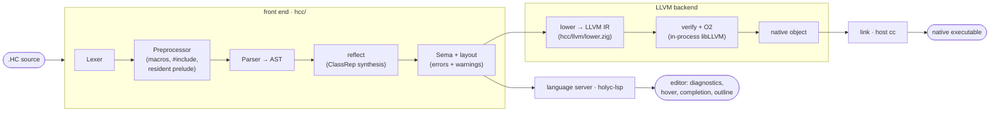

<div align="center">

# holyc

A HolyC toolchain in Zig: compiler, language server, and editor support.


</div>

The compiler turns `.HC` source into a native executable through **LLVM as its
one and only backend**: the front end (lexer, preprocessor with the resident
prelude, parser, semantic analysis, class layout) is pure Zig, lowering goes
straight from the checked AST to LLVM IR through the LLVM-C API linked
in-process, and the final artifact is linked with the host C toolchain — the
same move clang makes.

```text
$ sh install.sh
$ hcc -o sum sum.HC && ./sum
sum(1..100) = 5050
```

---

## Components

The repo is a Zig monorepo: one `zig build` produces every artifact, and the
tools share the compiler front end as a Zig module.

| Module | Path | What it is |
| --- | --- | --- |
| Compiler | [`hcc/`](hcc) | The HolyC compiler `hcc`: the front end as its own module (`hcc/frontend/`) and the LLVM backend as another (`hcc/llvm/` — the only module that links libLLVM). |
| Language server | [`lsp/`](lsp) | `holyc-lsp` for any LSP editor, driven by the same compiler front end (no LLVM dependency). Supersedes the separate `lsp-holyc` repo. |
| Tree-sitter grammar | [`tree-sitter-holyc`](https://github.com/project-solomon/tree-sitter-holyc) | The HolyC grammar: syntax highlighting, outline, and structural selection. |
| Zed extension | [`zed-holyc`](https://github.com/project-solomon/zed-holyc) | HolyC support for the [Zed](https://zed.dev) editor. |
| Integration suite | [`integration/`](integration) | An isolated black-box harness plus the conformance fixtures (`integration/testdata/`): it drives the installed `hcc` binary (resolved from the PATH) over every fixture with live per-fixture progress and compile/run timings, byte-comparing the produced executables' stdout against the reviewed goldens. |
| Benchmarks | [`bench/`](bench) | A timing harness over `.HC`/`.c` fixture pairs: compiles the HolyC side with `hcc` and the C side with `clang -O0..-O3`, reporting mean compile and execution times (`make bench`). |

---

## Quick start

Requirements: Zig 0.16 and LLVM 21 (`brew install llvm@21`; point the build at a
different install with `-Dllvm-prefix=/path/to/llvm`). `hcc` links libLLVM
**dynamically** — by design, there is no static-LLVM build — so the LLVM
install is needed at runtime too. Linking the executables hcc produces uses
the system `cc`. (`holyc-lsp` needs neither.)

```sh
# Build from source and install onto your PATH (checks for LLVM first,
# updates your shell profile if the install dir is missing from PATH)
sh install.sh            # or: make
sh install.sh --lsp      # install ONLY the holyc-lsp language server (no LLVM needed)
sh install.sh --upgrade  # replace an existing installation

# Compile a HolyC program to a native executable (defaults to the host)
hcc -o sum sum.HC
./sum

# Other outputs
hcc --emit obj    -o sum.o sum.HC   # relocatable object
hcc --emit shared -o libsum.dylib sum.HC
hcc --emit check  sum.HC            # front end + diagnostics only
hcc --emit ast    sum.HC            # dump the checked AST

# Cross-compile for another target: executables cross-link through
# `zig cc` (bundled sysroots — no setup) or an explicit --cc/HCC_CC driver;
# --emit obj skips linking entirely
hcc --target riscv64-unknown-linux -o sum.rv64 sum.HC
hcc --target amd64-pc-windows -o sum.exe sum.HC
hcc --emit obj --target amd64-unknown-linux -o sum.elf.o sum.HC

# Link against any shared library (see "Using C libraries")
hcc -L. -lgreeter -o hello hello.HC
```

Not from a checkout, install a tagged release instead:

```sh
curl -fsSL https://raw.githubusercontent.com/project-solomon/holyc/main/install.sh | sh
# Windows: irm https://raw.githubusercontent.com/project-solomon/holyc/main/install.ps1 | iex
```

The install scripts skip an existing installation unless `--upgrade`
(`-Upgrade` / `$env:HCC_UPGRADE` on Windows) is given. `--lsp` (`-Lsp`)
installs the language server *instead of* the compiler — holyc-lsp needs
neither hcc nor LLVM, so the LLVM check is skipped; run the script once per
binary to get both. Overrides:
`HCC_INSTALL_DIR` (default `~/.local/bin`), `HCC_VERSION` (release tag),
`HCC_FROM_SOURCE`, `HCC_LLVM_PREFIX`, `HCC_NO_MODIFY_PATH=1` to keep the
scripts out of your shell profile, and `HCC_SKIP_LLVM_CHECK=1` to install
without LLVM present.

Hacking on the compiler itself: plain `zig build` produces everything under
`zig-out/bin/` without installing.

A first program, `sum.HC`:

```holyc
I64 Sum(I64 n)
{
  I64 i, s = 0;
  for (i = 1; i <= n; i++)
    s += i;
  return s;
}

"sum(1..100) = %d\n", Sum(100);
```

---

## How it works



The front end is a reusable Zig module (rooted at `hcc/frontend/root.zig`,
imported as `hcc`); the backend is the `llvm` module (`hcc/llvm/`), and the
CLI in `hcc/main.zig` is a thin driver over both. The prelude — the dialect
core, not a standard library: the print engine behind implicit print
(`Print`/`StrPrint`), the `Mem` task heap, `KClass` reflection, the `CTask`
exception context, and process exit — lives as plain `.HC` files in
[`hcc/frontend/core/`](hcc/frontend/core), embedded into the binary at
compile time and injected ahead of every program. Everything else the host
offers is the C standard library, one `extern` declaration away.

Lowering choices worth knowing:

- **Aggregates are byte arrays.** Classes and unions lower to `[size x i8]`
  with every field access a byte-offset GEP driven by the compiler's own layout
  pass, so `offset()`, inheritance, anonymous members, and unions match HolyC
  semantics exactly, independent of LLVM struct layout.
- **Runtime = libc.** The prelude bottoms out in compiler intrinsics
  (`StdWrite`, `MAlloc`, `Exit`, …) that lower to libc calls; there is no
  separate runtime library to link.
- **Varargs are HolyC's own.** A variadic function receives hidden trailing
  `argc`/`argv` parameters (an array of 64-bit cells), exactly like TempleOS —
  `extern` C imports use the platform C ABI instead.
- **Exceptions are setjmp/longjmp** frames chained through the `CTask` context
  (`Fs->exc_top`), preserving `try`/`catch`/`throw` semantics.
- **Inline asm** blocks are arch-selected (`asm amd64 {…}`, `asm arm64 {…}`,
  `asm riscv64 {…}`, `asm ppc64le {…}`, `asm s390x {…}`) and lowered to LLVM
  module-level or inline assembly; `_extern` binds asm-defined labels to
  callable HolyC names. The architecture plan is in
  [docs/asm-roadmap.md](docs/asm-roadmap.md).

---

## Using C libraries

`extern` declares a function imported from a shared library, called with the
platform C ABI. libc is always linked, so the C standard library needs nothing
extra:

```holyc
extern I64 puts(U8 *s);
extern I64 printf(U8 *fmt, ...);  // real C varargs, not HolyC varargs
extern F64 sqrt(F64 x);

puts("hello from libc");
printf("sqrt(2) = %.3f\n", sqrt(2.0));
```

Any other shared library links with `-l`/`-L`, exactly like a C compiler
driver:

```sh
cc -shared -o libgreeter.dylib greeter.c
hcc -L. -lgreeter -o hello hello.HC     # hello.HC: extern I64 greet(U8 *name);
```

Type mapping at the boundary: `I64`/`U64` ↔ `long`/`size_t`/pointers-as-ints,
`I32`/`U32` ↔ `int`/`unsigned`, `U8*` ↔ `char*`/`void*`, `F64` ↔ `double`.
There is no F32, so C APIs taking `float` need a wrapper. The reverse direction
works too: `--emit shared` produces a library whose `public` HolyC functions
are callable from C (scalar signatures use the C ABI directly; HolyC-varargs
functions are not C-callable).

---

## The HolyC dialect

A host-targeting dialect that stays close to Terry Davis's HolyC while running
as an ordinary process:

- `U0`–`U64` / `I0`–`I64` / `F64` types, pointers, arrays, `class`/`union`
  (with inheritance and anonymous members).
- Reflection: `ClassRep`, `Class`, member metadata, `lastclass`.
- Exceptions: `try` / `catch` / `throw` over the task context.
- `switch` with ranges, `sub_switch`, and auto-numbered cases; function
  pointers; default and skip-able arguments.
- POSIX threads (`Thread`/`Join`), atomics, futexes — and `lock { … }` blocks
  whose read-modify-write operations compile to atomic instructions (the
  TempleOS LOCK prefix, made real).
- Host I/O: `Open`/`Read`/`Write`/`LSeek`/`Close` (fd-based, `-errno` on
  failure, Linux-style open flags everywhere), filesystem mutation, full TCP
  (`Socket`/`Connect`/`Bind`/`Listen`/`Accept` — enough for servers; the
  conformance suite includes a threaded loopback echo server), and nanosecond
  clocks (`UnixNS`/`NanoNS`/`CpuNS`, `Sleep`).
- Parenless calls, implicit print (`"x = %d\n", x;`), the backtick power
  operator, char constants packed up to 8 bytes (`'AB' == 0x4241`).
- Inline `asm` blocks (amd64, arm64, riscv64, ppc64le, s390x),
  `_extern`/`_import` asm linkage, `extern` dynamic imports (call any libc
  function directly).

---

## Building & testing

```sh
make test    # the CI gate: unit tests, then the black-box integration harness
make unit    # zig build test — frontend, backend, and LSP unit tests
make install # install.sh (install.ps1 on Windows) — builds hcc from source, installs it onto the PATH
make integration  # make install, then: ./zig-out/bin/integration integration/testdata
make fmt     # zig fmt build.zig hcc lsp integration bench
```

The integration harness (`integration/`) is the compiler's ground truth — and
a pure black box: it has no code dependency on the compiler, invoking the
installed `hcc` from the PATH (the `install` target runs `install.sh`, which
builds it from source, installs it onto the PATH, and checks that LLVM is
present). It compiles every fixture in
`integration/testdata/` with that binary, runs each produced executable, and
byte-compares its stdout against the reviewed `.out` golden — CLI, front end,
LLVM backend, and linker exercised together. The compiler's own unit tests are
hermetic and fast; the fixtures live only in the integration project.

Current scope: one source file per executable. Host executables link with the
system `cc`; cross executables link with `zig cc -target <triple>` (Zig ships
the sysroots) or whatever `--cc`/`HCC_CC` names.
`reg <REG>` pins are honored at asm-block boundaries (the variable is synced
through the named register around each block) rather than reserved for the
whole function, and symbolic displacements in asm memory operands are not
supported.

---

## License

[MIT](LICENSE).
