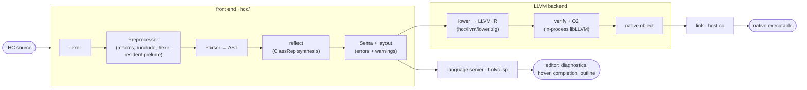

<div align="center">

# holyc

A HolyC toolchain in Zig: compiler, language server, and editor support.


</div>

The compiler turns `.HC` source into a native executable with **LLVM as the only
backend**. The front end (lexer, preprocessor, parser, semantic analysis, class
layout) is pure Zig; it lowers the checked AST to LLVM IR through the in-process
LLVM-C API, then links the result with the host C toolchain.

```text
$ sh install.sh
$ hcc -o sum sum.HC && ./sum
sum(1..100) = 5050
```

---

## Components

The repo is a Zig monorepo: one `zig build` produces every artifact, and the
tools share the compiler front end as a Zig module.

| Module | Path | What it is |
| --- | --- | --- |
| Compiler | [`hcc/`](hcc) | The HolyC compiler `hcc`: the front end as its own module (`hcc/frontend/`) and the LLVM backend as another (`hcc/llvm/`, the only module that links libLLVM). |
| Standard library | [`std/`](std) | The HolyC stdlib as on-disk `.HC` source shipped with the toolchain (installed into its self-contained tree at `~/hcc/std`), opt-in per program with `#include <Str.HC>`. Distinct from the always-injected prelude; whole-program compiled and dead-stripped like your own code. |
| Language server | [`lsp/`](lsp) | `holyc-lsp` for any LSP editor, driven by the same compiler front end (no LLVM dependency). Supersedes the separate `lsp-holyc` repo. |
| Tree-sitter grammar | [`tree-sitter-holyc`](https://github.com/project-solomon/tree-sitter-holyc) | The HolyC grammar: syntax highlighting, outline, and structural selection. |
| Zed extension | [`zed-holyc`](https://github.com/project-solomon/zed-holyc) | HolyC support for the [Zed](https://zed.dev) editor. |
| End-to-end suite | [`e2e/`](e2e) + [`golden/`](golden) | An isolated black-box harness (`e2e/`) that drives the installed `hcc` binary (resolved from the PATH) over every conformance fixture in `golden/`, with live per-fixture progress and compile/run timings, byte-comparing the produced executables' stdout against the reviewed goldens. |
| Benchmarks | [`bench/`](bench) + [`benchmarks/`](benchmarks) | A timing harness (`bench/`) over `.HC`/`.c` workload pairs in `benchmarks/`: compiles the HolyC side with `hcc` and the C side with `clang -O0..-O3`, reporting mean compile and execution times (`make bench`). |

---

## Quick start

Requirements: Zig 0.16 and LLVM 21 (`brew install llvm@21`; override the prefix
with `-Dllvm-prefix=/path/to/llvm`). `hcc` links libLLVM dynamically, so LLVM is
needed at runtime too; there is no static-LLVM build. Linking uses the system
`cc`. holyc-lsp needs neither.

```sh
# Build from source and install onto your PATH (checks for LLVM first,
# updates your shell profile if the install dir is missing from PATH)
sh install.sh            # or: make
sh install.sh --lsp      # install ONLY the holyc-lsp language server (no LLVM needed)
sh install.sh --upgrade  # replace an existing installation

# Compile a HolyC program to a native executable (defaults to the host)
hcc -o sum sum.HC
./sum

# Other outputs
hcc --emit obj    -o sum.o sum.HC   # relocatable object
hcc --emit shared -o libsum.dylib sum.HC
hcc --emit check  sum.HC            # front end + diagnostics only
hcc --emit ast    sum.HC            # dump the checked AST

# Cross-compile: executables cross-link with `zig cc` (bundled sysroots) or an
# explicit --cc/HCC_CC driver; --emit obj skips linking

hcc --target riscv64-unknown-linux -o sum.rv64 sum.HC
hcc --target amd64-pc-windows -o sum.exe sum.HC
hcc --emit obj --target amd64-unknown-linux -o sum.elf.o sum.HC

# Link against any shared library (see "Using C libraries")
hcc -L. -lgreeter -o hello hello.HC

# Use the bundled standard library (see "The standard library"), and add
# your own dirs to the #include <...> search path with -I
hcc -o greet greet.HC            # greet.HC: #include <Str.HC>
hcc -I ./vendor -o app app.HC    # also search ./vendor for <...> includes
```

Not from a checkout, install a tagged release instead:

```sh
curl -fsSL https://raw.githubusercontent.com/project-solomon/holyc/main/install.sh | sh
# Windows: irm https://raw.githubusercontent.com/project-solomon/holyc/main/install.ps1 | iex
```

The install scripts skip an existing installation unless `--upgrade` (`-Upgrade`
on Windows). `--lsp` (`-Lsp`) installs the language server instead of the
compiler (it needs neither hcc nor LLVM, so the LLVM check is skipped); run the
script once per binary to get both. Other flags: `--install-dir <dir>`,
`--version <tag>`, `--from-source` / `--download`, `--llvm-prefix <dir>`,
`--no-modify-path`, and `--skip-llvm-check`. Run `sh install.sh --help` (`-Help`
on Windows) for the full list. To pass flags through the `curl | sh`
pipe, use `sh -s --`:

```sh
curl -fsSL …/install.sh | sh -s -- --lsp --version v0.2.0
```

By default hcc installs as a self-contained tree at `~/hcc` (Go's GOROOT idea):
the binary at `~/hcc/bin/hcc`, the standard library at `~/hcc/std`, and
third-party packages under `~/hcc/pkg`. The installer adds `~/hcc/bin` to your
PATH; hcc finds the rest relative to its own location. Point the tree elsewhere
with `--install-dir <dir>/bin`.

Hacking on the compiler: plain `zig build` produces everything under `zig-out/`,
including the stdlib at `zig-out/std/`, which the built binary finds
automatically (`zig-out` is its toolchain root). No install needed.

A first program, `sum.HC`:

```holyc
I64 Sum(I64 n)
{
  I64 i, s = 0;
  for (i = 1; i <= n; i++)
    s += i;
  return s;
}

"sum(1..100) = %d\n", Sum(100);
```

---

## How it works



The front end is a reusable Zig module (`hcc/frontend/root.zig`, imported as
`hcc`); the backend is the `llvm` module (`hcc/llvm/`); `hcc/main.zig` is a thin
driver over both. The prelude is the dialect core, not a standard library: the
print engine behind implicit print (`Print`/`StrPrint`), the `Mem` task heap,
`KClass` reflection, the `CTask` exception context, and process exit. It lives
as `.HC` files in [`hcc/frontend/core/`](hcc/frontend/core), embedded in the
binary and injected ahead of every program. The **standard library**
([`std/`](std)) is separate: on-disk `.HC` source you opt into with `#include
<Str.HC>` (see [The standard library](#the-standard-library)). Everything else
the host offers is the C library, one `extern` declaration away.

Lowering choices worth knowing:

- **Aggregates are byte arrays.** Classes and unions lower to `[size x i8]`
  with every field access a byte-offset GEP driven by the compiler's own layout
  pass, so `offset()`, inheritance, anonymous members, and unions match HolyC
  semantics exactly, independent of LLVM struct layout.
- **Runtime = libc.** The prelude bottoms out in compiler intrinsics
  (`StdWrite`, `MAlloc`, `Exit`, …) that lower to libc calls; there is no
  separate runtime library to link.
- **Varargs are HolyC's own.** A variadic function receives hidden trailing
  `argc`/`argv` parameters (an array of 64-bit cells), like TempleOS. `extern` C
  imports use the platform C ABI instead.
- **Exceptions are setjmp/longjmp** frames chained through the `CTask` context
  (`Fs->exc_top`), preserving `try`/`catch`/`throw` semantics.
- **Inline asm** blocks are arch-selected (`asm amd64 {…}`, `asm arm64 {…}`,
  `asm riscv64 {…}`, `asm ppc64le {…}`, `asm s390x {…}`) and lowered to LLVM
  module-level or inline assembly; `_extern` binds asm-defined labels to
  callable HolyC names. The architecture plan is in
  [docs/asm-roadmap.md](docs/asm-roadmap.md).

---

## The standard library

Beyond the always-in-scope prelude, a standard library of ordinary utilities
ships as **on-disk HolyC source** at `~/hcc/std`, pulled in per program with an
angle-bracket include:

```holyc
#include <Str.HC>
#include <Math.HC>

U8 buf[32];
StrCpy(buf, "holy");
StrCat(buf, "c");
"%s is %d chars; sqrt(2) = %.3f\n", buf, StrLen(buf), Sqrt(2.0);
```

Nothing here is implicit — a program opts into each module. Because it's plain
source compiled together with your program (not a linked library), unused
functions are dead-stripped and hot ones inline, and the executable stays
self-contained with nothing extra at runtime. The first modules are `Str.HC`
(`StrLen`/`StrCmp`/`StrCpy`/`StrCat`/`StrFind`), `Mem.HC`
(`MemCpy`/`MemSet`/`MemCmp`), and `Math.HC`
(`Sqrt`/`Pow`/`Sin`/`Cos`/`Exp`/`Log`/`Floor`/`Ceil`/`Trunc`/`Round`/`Abs` …).
The `Math.HC` functions are **compiler primitives**: each lowers to the matching
LLVM math intrinsic, so `Sqrt`/`Floor`/`Abs`/… become single hardware
instructions and fold at compile time on constant arguments — not opaque libm
calls.

**Resolution and packages.** `#include <name>` searches, in order: each
`-I <dir>` on the command line, then `$HCC_PATH/pkg`, then `$HCC_ROOT/std` (the
bundled stdlib). `HCC_ROOT` is the toolchain tree (default: the parent of the
dir holding `hcc`, i.e. `~/hcc`, resolved from the binary's own path);
`HCC_PATH` — where third-party packages live — defaults to `HCC_ROOT`, so they
resolve under `~/hcc/pkg`. Both env vars override. Bare names name the stdlib;
a third-party package is just a directory of `.HC` source under `$HCC_PATH/pkg`,
addressed by a domain-qualified path:

```holyc
#include <github.com/user/json/Json.HC>
```

This mirrors Go's toolchain root (`HCC_ROOT`, like `GOROOT`) and package path
(`HCC_PATH`, like `GOPATH`) — here they default to the same self-contained tree,
but `HCC_PATH` can point elsewhere. It's collision-free because stdlib names are
always bare while packages are always domain-qualified.
Installing a package is nothing more than placing its source on that path; there
is no build artifact, since everything is compiled from source with your
program. Plain `#include "..."` is unchanged — it resolves relative to the
including file (or, `::`-prefixed, by TempleOS upward search), for a program's
own files.

## The manifest — `hcc.toml`

An `hcc.toml` at the project root is dependency manager and build file in one:
a module `name`, shared `[build]` flags, a list of `[[dependencies]]`, and a
list of `[[bin]]` executables.

```toml
name = "github.com/you/myapp"           # this module's import path (Go's `module`)

[build]                                 # shared compiler flags
target = "arm64-darwin"                 # default: host
libs   = ["m"]                          # -l ; also lib-dirs (-L), include (-I), cc

[[dependencies]]
git     = "github.com/terry/json"       # remote source, cloned into $HCC_PATH/pkg
version = "v1.4.0"                       # git tag
# alias defaults to `json` (the last segment of json's own `name`)

[[dependencies]]
path = "../mylib"                        # local submodule directory (never cloned)
as   = "lib"                             # override the include alias

[[bin]]
name = "myapp"
path = "src/main.HC"                     # entrypoint: its top-level stmts = main
```

**`name`** is the module's canonical import path — where it's hosted and how
others depend on it (the same string a consumer puts in `git`), exactly like
Go's `module` directive. **Dependencies** are sourced by `git` (remote) or
`path` (local submodule); each is included under the **last segment** of its
`name` (`github.com/terry/json` → `json`), overridable per dependency with `as`:

```holyc
#include <json/Json.HC>   // last segment of the dependency's name
#include <lib/Sub.HC>     // ../mylib, renamed to `lib` via `as`
```

Resolution for `#include <X/…>`: an alias `X` from `hcc.toml` (`as` → last
segment of the dependency's `name` → last segment of its source path), then a
bare name against the stdlib, then `X/…` as a literal package path. The compiler reads the nearest
`hcc.toml` walking up from the file being compiled; with no manifest, includes
behave as if the module system weren't there. Local submodules and remote deps
are both followed recursively, so a dependency's own dependencies resolve too.

```sh
hcc init github.com/you/myapp         # scaffold hcc.toml (name required; dir defaults to .)
hcc get                               # clone/update everything the manifest lists
hcc get github.com/terry/json@v1.4.0  # add + clone a remote dependency
hcc build                             # compile every [[bin]] with the [build] flags
hcc build myapp                       # …or just the named one
hcc install                           # build + copy this project's executables to the bin dir
hcc install github.com/you/tool@v1.0.0 # fetch, build, and install a command from a repo
```

`hcc get` clones into `$HCC_PATH/pkg` and appends a `[[dependencies]]` record;
local `path` dependencies are left alone. Like `go get`, it runs only inside a
project — it never creates a manifest, so start one with `hcc init`. `hcc build`
reuses the normal compile path once per executable — a project with no `[[bin]]`
is a library (source consumed via `#include`, nothing to link). `hcc install`
works like `go install`: it drops the built executables into the bin dir
(`$HCC_BIN`, else `$HCC_ROOT/bin`, which is on your PATH), and with a remote
import path it fetches and installs a command without touching the current
project.

This is minimal by design: a GOPATH-style flat cache with one checkout of each
module, shared across projects, no lockfile, and no transitive version
resolution (list a dependency's own dependencies explicitly). The format can
grow into a versioned cache later without changing.

---

## Using C libraries

`extern` declares a function imported from a shared library, called with the
platform C ABI. libc is always linked, so the C standard library needs nothing
extra:

```holyc
extern I64 puts(U8 *s);
extern I64 printf(U8 *fmt, ...);  // real C varargs, not HolyC varargs
extern F64 sqrt(F64 x);

puts("hello from libc");
printf("sqrt(2) = %.3f\n", sqrt(2.0));
```

Any other shared library links with `-l`/`-L`, exactly like a C compiler
driver:

```sh
cc -shared -o libgreeter.dylib greeter.c
hcc -L. -lgreeter -o hello hello.HC     # hello.HC: extern I64 greet(U8 *name);
```

Type mapping at the boundary: `I64`/`U64` ↔ `long`/`size_t`/pointers-as-ints,
`I32`/`U32` ↔ `int`/`unsigned`, `U8*` ↔ `char*`/`void*`, `F64` ↔ `double`.
There is no F32, so C APIs taking `float` need a wrapper. The reverse direction
works too: `--emit shared` produces a library whose `public` HolyC functions
are callable from C (scalar signatures use the C ABI directly; HolyC-varargs
functions are not C-callable).

---

## The HolyC dialect

A host-targeting dialect that stays close to Terry Davis's HolyC while running
as an ordinary process:

- `U0`–`U64` / `I0`–`I64` / `F64` types, pointers, arrays, `class`/`union`
  (with inheritance and anonymous members).
- Reflection: `ClassRep`, `Class`, member metadata, `lastclass`.
- Exceptions: `try` / `catch` / `throw` over the task context.
- `switch` with ranges, `sub_switch`, and auto-numbered cases; function
  pointers; default and skip-able arguments.
- POSIX threads (`Thread`/`Join`), atomics, futexes, and `lock { … }` blocks
  whose read-modify-write operations compile to atomic instructions (TempleOS's
  LOCK prefix).
- Host I/O: `Open`/`Read`/`Write`/`LSeek`/`Close` (fd-based, `-errno` on
  failure, Linux-style open flags), filesystem mutation, TCP
  (`Socket`/`Connect`/`Bind`/`Listen`/`Accept`), and nanosecond clocks
  (`UnixNS`/`NanoNS`/`CpuNS`, `Sleep`).
- Parenless calls, implicit print (`"x = %d\n", x;`), the backtick power
  operator, char constants packed up to 8 bytes (`'AB' == 0x4241`).
- Compile-time code generation with `#exe { … }`: the block is compiled and run
  while hcc compiles (on the host, even when cross-compiling), and its stdout is
  spliced back in as source. It sees the file's preceding declarations, so it can
  call your own functions to emit tables or code — e.g.
  `#exe { "I64 sq[8]={"; I64 i; for (i=0;i<8;i++) "%d,", Sq(i); "};\n"; }`.
- A C-style preprocessor over TempleOS's: object-like **and** function-like
  macros (`#define SQ(x) ((x)*(x))`) with argument pre-expansion, variadics
  (`__VA_ARGS__`), the `#` stringize and `##` paste operators, and GNU
  `, ## __VA_ARGS__` comma elision; plus `#if`/`#elif` constant expressions with
  `defined(...)` alongside the native `#ifdef`/`#ifndef`/`#include`.
- Inline `asm` blocks (amd64, arm64, riscv64, ppc64le, s390x),
  `_extern`/`_import` asm linkage, `extern` dynamic imports (call any libc
  function directly).

---

## Building & testing

```sh
make test    # the CI gate: unit tests, then the black-box e2e harness
make unit    # zig build test — frontend, backend, and LSP unit tests
make install # install.sh (install.ps1 on Windows) — builds hcc from source, installs it onto the PATH
make e2e     # make install, then: ./zig-out/bin/e2e golden
make fmt     # zig fmt build.zig hcc lsp e2e bench
```

The e2e harness (`e2e/`) is a black box: it has no code dependency on the
compiler and invokes the installed `hcc` from the PATH (the `install` target
runs `install.sh`, which builds hcc, installs it, and checks for LLVM). It
compiles every fixture in `golden/`, runs each executable, and byte-compares
stdout against the reviewed `.out` golden, exercising the CLI, front end, LLVM
backend, and linker together. The unit tests are hermetic and fast.

Current scope: one source file per executable. Host executables link with the
system `cc`; cross executables link with `zig cc -target <triple>` (Zig ships
the sysroots) or whatever `--cc`/`HCC_CC` names.
`reg <REG>` pins are honored at asm-block boundaries (the variable is synced
through the named register around each block) rather than reserved for the
whole function, and symbolic displacements in asm memory operands are not
supported.

---

## License

[MIT](LICENSE).
